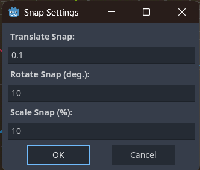

# brackeys-godot-3d
I wanted to follow along Brackey's latest video and experiment with 3D game development in Godot

## 3D Physics Engine
**Brackey's suggested** to use the Jolt Engine, I went ahead and installed it via the Asset Library. Apparently Jolt will ship with Godot 4.4 out of the box, so I can update this project later when Godot 4.4 releases it's first stable version.

## 3D Editor, Navigation and Tools
I learned a bit about using the transformation section on the right to edit 3d nodes. The gizmo's are also really useful for this.

Some default shortcuts to be aware of:
 - Q : Select Mode
 - W : Move Mode
 - E : Rotate Mode
 - R : Scale Mode

Hold `Ctrl` while using these to enable snapping. Also pressing `T` will toggle between local mode and global mode. This will update the orientation of your gizmos.

**Brackey's suggested** adding a custom shortcut. Under Editor -> Editor Settings -> Shortcuts -> Begin Rotate Transformation. I bound this to `Shift + R`. This will start a rotation transformation that follows the mouse, and if you type `X`, `Y`, or `Z`, it will lock this rotation to the corresponding axis.

## Prototype with Greyboxing
It is so essential to start out with prototypes for our levels, to avoid wasting time bogged down in the details when our idea is not concrete yet.

Godot makes this very quick and easy through the use of CSG nodes. Constructive Solid Geometry.

**Brackey's suggests** Using snapping when prototyping, and he also updated his snap settings. Transform -> Configure Snap

